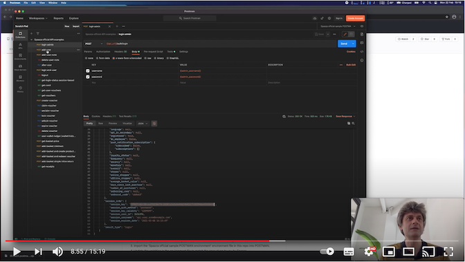

# Spaaza POSTMAN Collections
Official POSTMAN collections and environment files to enable running POSTMAN requests against the Spaaza API. 

## What is Spaaza?

Spaaza is an incentive marketing platform with tools which are used by brands and retailers to run
either individual promotional activities, or combined as a whole loyalty platform. Many well-known
global brands use Spaaza's API-based platform and tools, including portals, webshop and POS
integrations, apps and analytics service to run their promotional programmes.

You can find out more about Spaaza on our website at [spaaza.com](https://www.spaaza.com) and 
contact us or request a demo via the contact button in the bottom right of the site. Once the 
lockdown is over, you can even pop along to our office in Amsterdam if you happen to be in the 
neighbourhood and want to say hi.

## Where can I find more information about Spaaza's API?

Our [API site](https://docs.spaaaza.com) should tell you all you need to know. There are also notes
added to each API request in the POSTMAN collections which should be useful.

## How do I get started with the POSTMAN collection?

Getting started is quite easy:

1. You will need to have a Spaaza account for our testing environment. Please get in contact with us
   to obtain these (see details above).
2. Import the 'Spaaza official API examples' POSTMAN collection file in this repo into POSTMAN.
3. Import the 'Spaaza official sample POSTMAN environment' environment file in this repo into POSTMAN.
4. Update the variables in the environment file to match the ones given to you by Spaaza.
5. Start sending API requests and seeing responses.

Most of the API requests require authentication, so you should start with the 'login admin' API
request, which automatically populates the session variables which can be used with the other 
requests.

It's definitely worth reading the Spaaza API documentation 'Concepts' section to get a better 
understanding of the way Spaaza works.

## Do you have any tips and hints on using the POSTMAN collection with the Spaaza API?

Sure, there are some videos on the [Spaaza YouTube channel](https://www.youtube.com/channel/UCvM1ZMg-jOGDSdcnrobIPSQ)
including the following:

More coming soon - we'll be adding guides, videos and new endpoints here.
