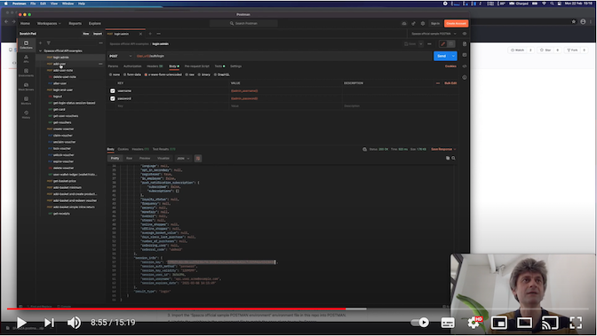

# Spaaza POSTMAN Collection
Official POSTMAN collection and environment file for working with the Spaaza API and Resources API in POSTMAN.

## Contents

- [What is Spaaza?](#what-is-spaaza)
- [Where can I find more information about Spaaza's API?](#where-can-i-find-more-information-about-spaazas-api)
- [What does the POSTMAN collection cover?](#what-does-the-postman-collection-cover)
- [How do I get started with the POSTMAN collection?](#how-do-i-get-started-with-the-postman-collection)
- [Using the collection with the "Talk to the Spaaza API" AI agent skill](#using-the-collection-with-the-talk-to-the-spaaza-api-ai-agent-skill)
- [Do you have any tips and hints on using the POSTMAN collection with the Spaaza API?](#do-you-have-any-tips-and-hints-on-using-the-postman-collection-with-the-spaaza-api)

## What is Spaaza?

Spaaza is an incentive marketing platform with tools which are used by brands and retailers to run
either individual promotional activities, or combined as a whole loyalty platform. Many well-known
global brands use Spaaza's API-based platform and tools, including portals, webshop and POS
integrations, apps and analytics service to run their promotional programmes.

You can find out more about Spaaza on our website at [spaaza.com](https://www.spaaza.com) and 
contact us or request a demo via the contact button in the bottom right of the site. You can even
pop along to our office in Amsterdam if you happen to be in the neighbourhood and want to say hi.

## Where can I find more information about Spaaza's API?

Our [Developer Documentation Site](https://docs.spaaza.com) should tell you all you need to know. There are also notes
added to each API request in the POSTMAN collections which should be useful.

## What does the POSTMAN collection cover?

The collection is intended to help developers explore and test publicly documented Spaaza API endpoints.

It includes authentication flows and example requests for:

- Authentication
- Baskets
- Businesses
- Campaigns
- Chains
- Notes
- Products
- Resources API
- Services API
- Tags
- Users
- Vouchers
- Wallets
- Miscellaneous public endpoints

Most requests use session-based authentication headers. A typical flow is:

1. `login admin (sends OTP to email)`
2. `session (paste OTP from email)`
3. run other authenticated requests with the saved session variables

The collection also includes example headers such as `X-Spaaza-API-version`, `X-Spaaza-Session-User-Id`, `X-Spaaza-Session-Key`, `X-Spaaza-Chain-ID`, and `X-MyPrice-App-Hostname` where relevant.

## How do I get started with the POSTMAN collection?

Getting started is quite easy:

1. You will need to have a Spaaza account which is able to access the API. Please get in contact with us
   to obtain these (see details above).
2. Import the 'Spaaza official API examples' POSTMAN collection file in this repo into POSTMAN.
3. Import the 'Spaaza official sample POSTMAN environment' environment file in this repo into POSTMAN.
4. Update the variables in the environment file to match the ones given to you by Spaaza.
5. Start sending API requests and seeing responses.

Most of the API requests require authentication, so you should start with the 'login admin' API
request, which automatically populates the session variables which can be used with the other 
requests.

It's definitely worth reading the Spaaza API documentation 'Concepts' section to get a better 
understanding of the way Spaaza works.

## Using the collection with the "Talk to the Spaaza API" AI agent skill

Spaaza also provides a public AI agent skill, [Talk to the Spaaza API](https://docs.spaaza.com/api/ai-agent-skills/talk-to-spaaza-api/), for natural-language interaction with the API.

The POSTMAN collection and the AI agent skill work well side-by-side:

- the POSTMAN collection gives concrete example requests, headers, parameters, and request bodies,
- the documentation site explains endpoint behaviour and concepts,
- the AI agent skill can help interpret tasks, choose endpoints, and formulate valid API calls.

If the collection is available locally, an AI agent can also inspect the collection JSON directly to understand example request shapes, authentication headers, and documented parameter usage before making or suggesting API calls.

For best results, use the POSTMAN collection together with:

- [Developer Documentation Site](https://docs.spaaza.com)
- [AI Agent Skills overview](https://docs.spaaza.com/api/ai-agent-skills/)
- [Talk to the Spaaza API](https://docs.spaaza.com/api/ai-agent-skills/talk-to-spaaza-api/)

## Do you have any tips and hints on using the POSTMAN collection with the Spaaza API?

Sure, there are some videos on the [Spaaza YouTube channel](https://www.youtube.com/channel/UCvM1ZMg-jOGDSdcnrobIPSQ)
including the following:

Getting started with the Spaaza API:

More coming soon - we'll be adding guides, videos and new endpoints here.
